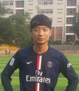

## Self Introduce
I am Barack, a Software engineer, and I am also a good forward of soccer.   

## Education
Anhui Agricultural University, Bachelor of Electronic Information Engineering （2014~2018）

## Skill
- **Programming Language**: Java, python, VBA, Uipath
- **Tools**: IDEA, GIT, SVN, CI-CD tools
- **Other skills**: Strong communication skills, strong problem-solving skills, strong task management skills, 
- strong product awareness, strong innovation skills, strong leadership

