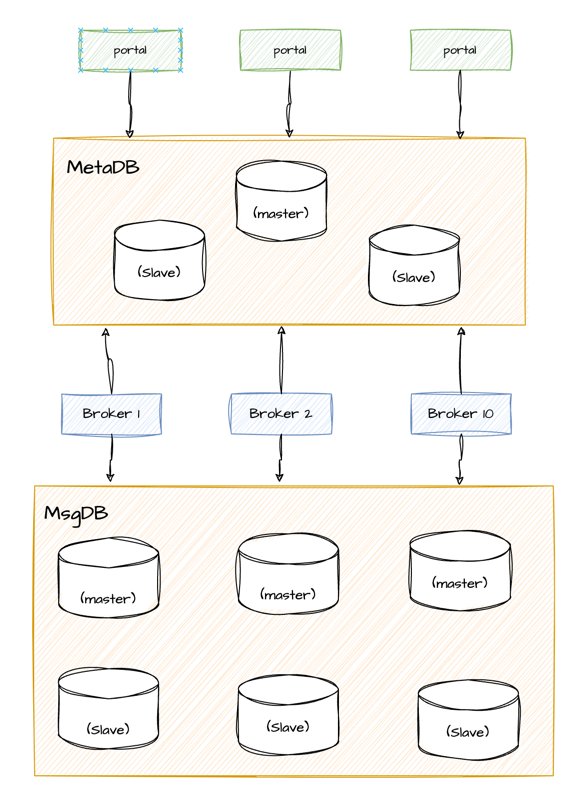

---

weight: 15
title: "运维部属"
---

# 部署文档

## 单机部署
单机部署可以参考另一篇文章Quickstart。
- [快速开始]()

## 分布式部署
CatMQ 服务端需要部署的两个包是`CatMQ-rest` （server端）和`CatMQ-ui`(portal端), 并且server端和portal端都是无状态，并且内部自制了简单
的服务发现功能，所以可以在不搭配其他的分布式组件的形式下使用和发布。      
只需要在\catmq-rest\src\main\resources 和 \catmq-ui\src\main\resources 下添加对应的环境配置即可，例如添加fat环境，
只需要在上面对应的目录中添加application-fat.properties 文件即可，对应的配置项跟其他环境一样，只是值可能不同。
 
CatMQ中自制的服务发现功能，将各个server端和portal端的状态信息都存在数据库中，并且每隔5秒钟注册心跳，所以只要server端和portal端成功链接上
数据库即可自动服务发现。这种方案也可以结合Eureka , nginx, nacos 等服务发现的组件。
 
CatMQ 分布式部署重点在于数据库的集群部署，建议使用主从数据库的方式部署元数据库（1主2从），并且交由infrastructure 运维团队运维。确保元数据
正常使用. 部署的架构图如下所示：

