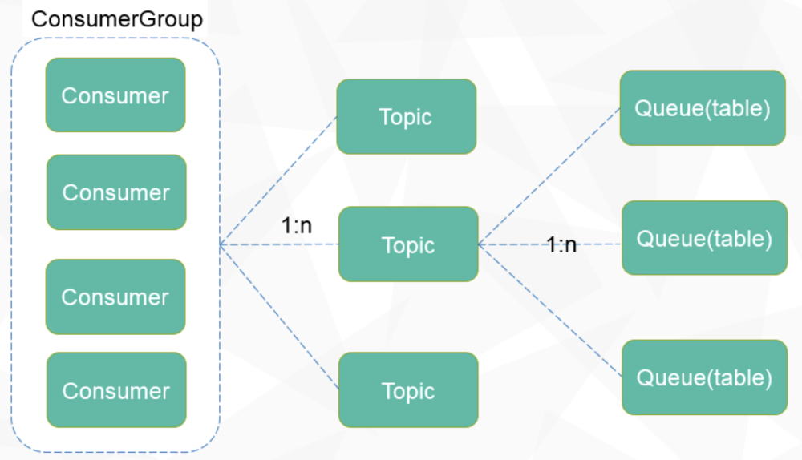
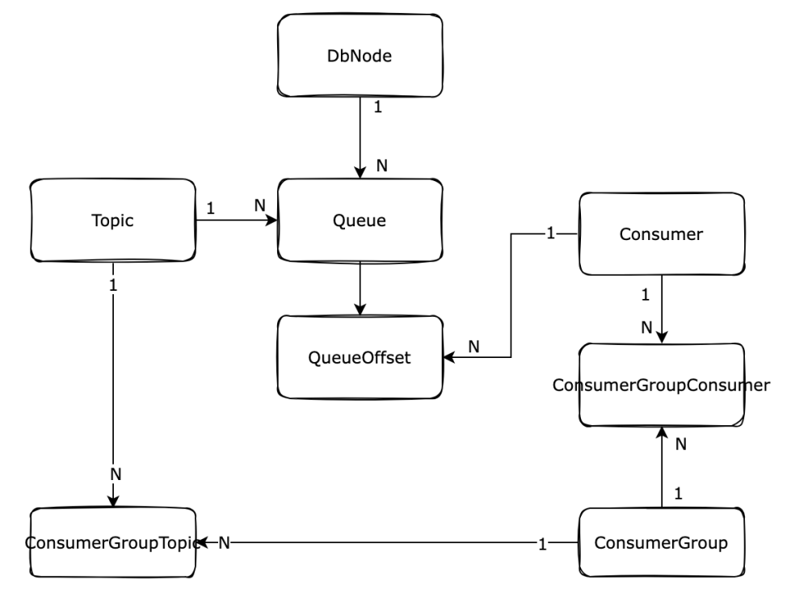

# Overall Design

> **Note:** If you are not familiar with distributed queue systems, it is recommended to read the quick start 
> module before diving into the overall design. 
> Hands-on experience in implementing a queue demo will help you better understand the design.

## 1. Message Model

The overall message model mainly involves three modules:

1. **ConsumerGroup**: Represents a collection of topics and serves as a mechanism for organizing and coordinating consumers in CatMQ. It is subscribed by a group of consumers who collectively consume the topics under this consumer group.

2. **Topic**: A messaging topic in CatMQ, serving as a logical concept for organizing and categorizing messages. Each message belongs to a specific topic, and consumers subscribe to these topics to receive corresponding messages.

3. **Queue**: A container in CatMQ for storing messages, designed as a MySQL table in CatMQ. Each topic can have multiple queues, analogous to partitions in Kafka.

The relationships among the three modules are illustrated in the following diagram:

## 2. Architecture Model

The architecture modules are shown in the figure below. The descriptions of each module in the figure are as follows:

1. **Broker**  
   CatMQ's server, primarily responsible for message delivery, retrieval, and querying, ensuring high availability of messages. Core functionalities include:
   a. Provide message sending interface
   b. Provide message retrieval interface
   c. Dynamic rebalancing of queues and consumer groups
   d. Metadata synchronization
   e. Provide synchronization of consumer offsets

2. **Portal**  
   CatMQ's management interface, serving as a visualization management console for CatMQ and acting as a NameServer for managing Brokers and routing. Core functionalities include:
   a. Visualization of ConsumerGroup, topic, and Queue creation and modification
   b. Management of subscription relationships
   c. Support for message queries
   d. Various audit logs and access controls
   e. Various monitoring reports
   f. Timers for monitoring system stability

3. **Producers/Consumers**  
   CatMQ's producers/consumers, both belonging to the CatMQ client. Core functionalities include:
   a. Synchronous and asynchronous message sending
   b. Message retrieval and consumption
   c. Client heartbeat and offset submission
   d. Retry and sending of failed messages

4. **Metadata**  
   CatMQ's metadata database, used to record the configuration information needed by CatMQ. Core functionalities include:
   a. Store consumerGroup, topic, and subscription relationships
   b. Store information about database nodes
   c. Store allocation relationships for Queue and topic
   d. Store message offsets

5. **Message**  
   CatMQ's message database, used to persist all messages.

## 3. E-R Diagram

1. **DbNode**: Records information about the database nodes storing messages, including JDBC URL, username, and password.

2. **Consumer**: Represents the currently active consumers in the system.

3. **Queue**: Records actual allocation information for topics and queues.

4. **QueueOffset**: Records the actual correspondence between consumers and queues, including their consumption offsets (records information about a consumer consuming a specific queue).

5. **Topic**: Consists of multiple queues and is used to store messages.

6. **ConsumerGroup**: A collection of topics used to record consumer groups in the system.

7. **ConsumerGroupConsumer**: Records the relationships between consumers and consumer groups in the system.

8.  **ConsumerGroupTopic**: used to record ConsumerGroup and Topic
    Corresponding relationship

