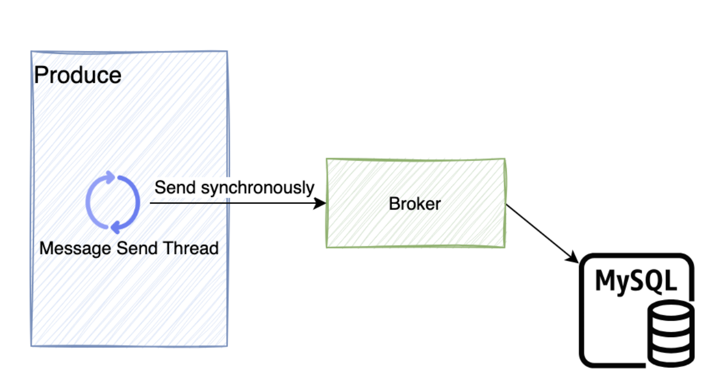

# Client Design

When designing the client, following the principles of simplicity and efficiency, I have integrated producers and consumers into the same client. This way, external users only need one client to interact with the Broker.

## 1. Consumer Design

In the diagram, "Broker" represents the CatMQ server module, and "Consumer" represents the client's consumer module.

Let's briefly introduce the implementation principle of CatMQ's consumer side:

1. **Pull Consumer Thread**: Based on the message offset (QueueOffset, the current consumption position of the consumer), messages are pulled from the Broker to the local consumption queue.

2. **Application Consumer Thread**: Messages are pulled from the local consumption queue for processing.

3. **Offset Submission Thread**: Periodically submits the current consumption information to the Broker.

4. **Heartbeat Thread**: Periodically reports heartbeat to the Broker.

5. **Failed Message Retry Thread**: Retries consumption of failed messages.

## 2. Producer Design

The message sending of the producer is divided into two modes: synchronous and asynchronous.

### 2.1. Synchronous Mode

In the diagram, "Producer" represents the producer, and "Broker" represents the server.

The synchronous mode is a straightforward message storage mode. The producer sends messages to the server, and the server persists the message and returns the result of the persistence.

### 2.2. Asynchronous Mode

In the diagram, "Producer" represents the producer, and "Broker" represents the server.

The asynchronous sending mode increases efficiency by reducing external communication and I/O interactions. It is typically used for less critical message delivery.

1. **Application Sending Thread**: Messages are first sent to the local buffer queue.

2. **Batch Sending Thread**: Messages from the buffer queue are sent to the broker in batches.

3. **Broker inserts messages into the database in batches.**