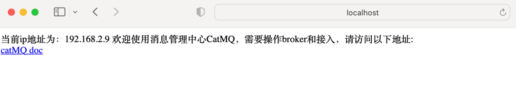
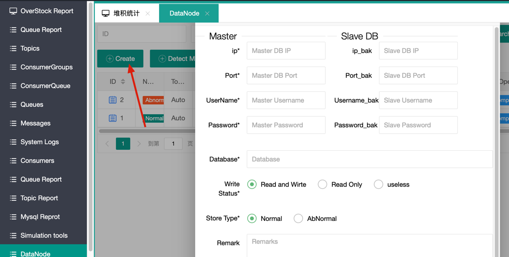
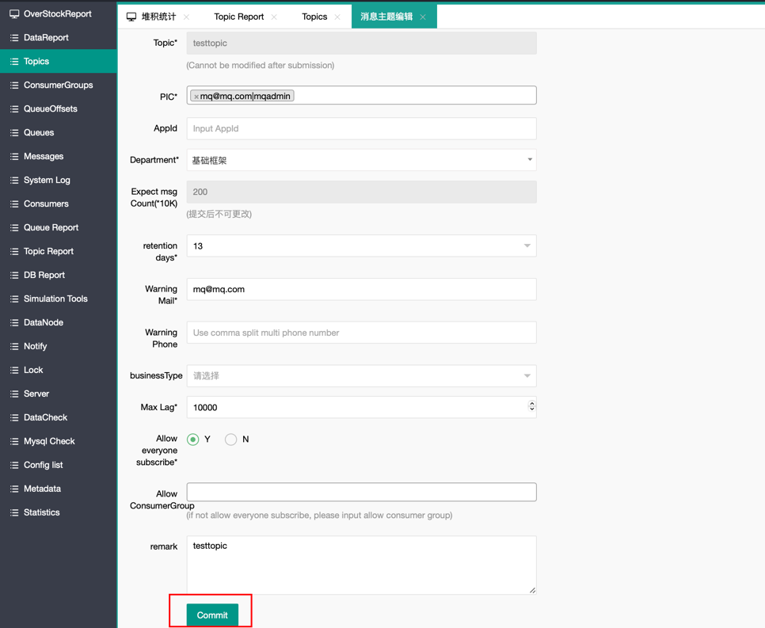
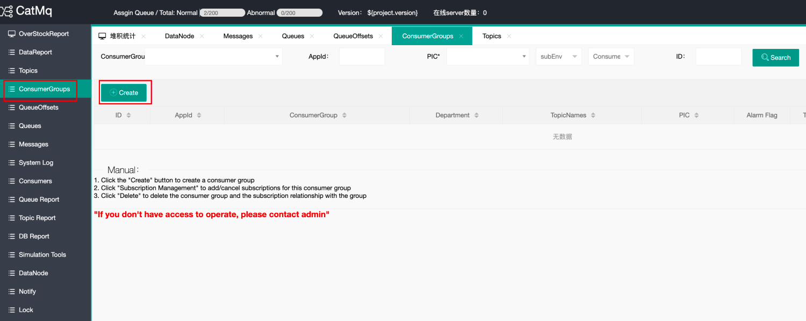
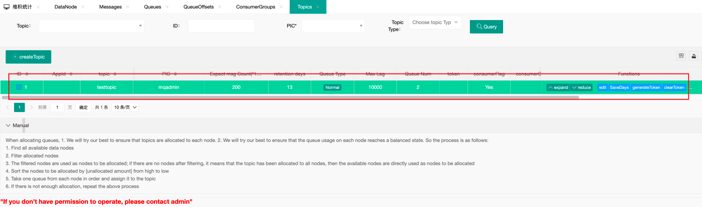
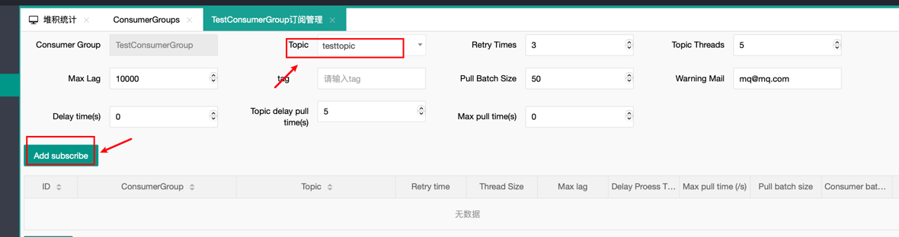
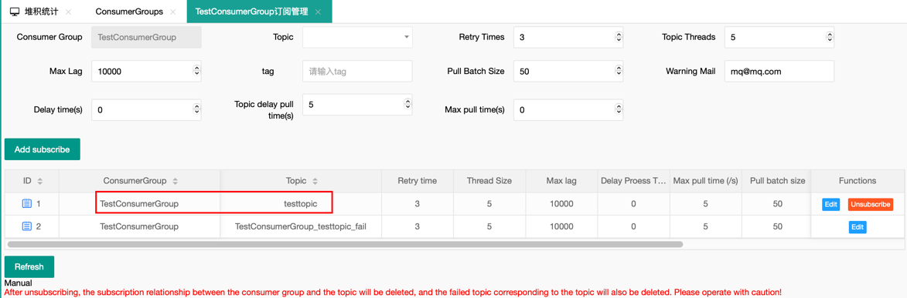

# Quick Start

This page will provide a brief guide on how to quickly set up a single-node CatMQ instance.

## (I) Environment Setup

1. **Java**
   This project is developed based on JDK 1.8 or later. You will need JDK 1.8 or later to run the project. After configuring Java, you can check the Java environment using the `java -version` command. Sample output:

   ```shell
   java -version
   Java(TM) SE Runtime Environment (build 1.8.0_74-b02)
   Java HotSpot(TM) 64-Bit Server VM (build 25.74-b02, mixed mode)
   ```

2. **Maven**
   Maven 3.0 or later is required. You can download the latest version from the official website. After installing Maven, check the configuration by opening the command prompt and entering `mvn -v`. If the configuration is correct, you will see output similar to the following:

   ```shell
   Maven home: D:\software\apache-maven-3.6.2\bin\..
   Java version: 1.8.0_262, vendor: Red Hat, Inc., runtime: D:\software\openjdk-1.8.0.262\jre
   Default locale: en_US, platform encoding: GBK
   OS name: "windows 10", version: "10.0", arch: "amd64", family: "windows"
   ```

3. **MySQL**
   Version 5.7 or later is required. After connecting to MySQL, you can check the version using the following command:
   `SHOW VARIABLES WHERE Variable_name = 'version';`

   | Variable_name | Value |
      | :------------ | ----: |
   | version       | 5.7.0  |

   CatMQ needs to access the `information_schema.tables` dictionary table to retrieve information about table increments for calculating pending messages and other information. Ensure that this table is promptly updated. For MySQL 8 and above, it is recommended to check `show variables like '%information_schema_stats%'; set global information_schema_stats_expiry=10;` to set the update time for the dictionary table.

## (II) Installation Steps

1. Download the code from GitHub to your local machine. For this example, let's assume the project directory is `d://catmq`.

2. Create Databases:
   CatMQ requires three types of databases: metadata database, normal message database, and failed message database. Create the databases as follows:
   - Execute the `doc/mq_basic.sql` script to create the metadata database (only one needed, can set up master and standby).
   - Execute the `doc/mq_message_node_01.sql` script to create the normal message database.
   - Execute the `doc/mq_fail_message_node_01.sql` script to create the failed message database.

   Here's an example of the created databases: `mq_basic`, `mq_suc`, and `mq_fail`.

3. Configure Database Information:
   CatMQ comes with default configurations for three environments: `fat`, `uat`, and `pro`. Users can add configurations for other environments by setting `Spring_active`. In the following demonstration, we will use the `fat` environment. Open the following files with a text editor:
   - `d://catmq/mq-ui/src/main/resources/application-fat.properties`
   - `d://catmq/mq-rest/src/main/resources/application-fat.properties`

   Add the metadata database information:

   ```properties
   spring.datasource.url = jdbc:mysql://localhost:3306/mq_basic?useUnicode=true&characterEncoding=utf8&useSSL=false
   spring.datasource.username = root
   spring.datasource.password = root
   ```

4. Compile and Run:
   Open the command prompt in `d://catmq` and run `mvn clean install -DskipTests`. If the console displays "success," the compilation is successful. By default, the portal uses port 8089, the server uses port 8080, and the test demo uses port 8087. Then navigate to:

   - Go to the `d://catmq/mq-rest/target` directory and run the following command to start the server:

   ```shell
   java -jar mq-rest.jar --spring.profiles.active=fat
   ```

   - Go to the `d://catmq/mq-ui/target` directory and run the following command to start the portal:

   ```shell
   java -jar mq-ui.jar --spring.profiles.active=fat
   ```

   Note: The test demo cannot be started immediately (you need to wait for the initialization of the message database and manually create the necessary topics, consumer groups, and subscription relationships on the portal).

5. Verify System Startup:
   Open Google Chrome and visit http://localhost:8080/. If the page appears as shown below, the CatMQ server has started successfully.
   Visit http://localhost:8090/. If the login page appears and you can log in successfully, it means the portal is accessible. The username and password are both `mqadmin`.
   


## (III) Metadata Initialization

To run tests, we need to initialize some data.

1. Initialize the storage location for messages:

   1. Start CatMQ's management page (CatMQ-ui module). Log in to the system with the account and password `mqadmin`. Then click on "DataNode."
      

   2. Click on "Create."
      

   3. In the detailed database information that pops up, there are main database (master) and secondary database (slave) sections. If there is no secondary database, you can leave it empty. The database is the connection information for `mq_suc` mentioned in the previous section.

   > Note: If the "Database" is filled in with the name of the normal message database, the "Store Type" should be selected as normal (as indicated in the red box in the figure). If the "Database" is filled in with the name of the failed message database, the "Store Type" should be selected as Abnormal.

   4. Click "Submit." If you see the record as shown below, it means the initialization of the `message_node_01` node was successful.

## (IV) Display of Client Demo

After completing the above steps, you can go to the mq-client-demo module of CatMQ and start this module. The `messageQueue.xml` file defines the ConsumerGroup, Topic, and their subscription relationships (meaning: `test1sub` subscribes to the topics `test1` and `test4`). The `receiverType` specifies the message processing class for each topic.

The demo is the smallest executable example of CatMQ in the project. Here, we have configured the `messageQueue.xml`, so you don't need to make any modifications.

1. Create a topic  
   Log in to the system management page (Portal), which is by default at localhost:8090. The initialized username and password are both `mqadmin`. After logging in, click on "Message Topic Management" on the left side to enter the following page:
     
   Click the "Create" button to enter the topic creation page. Then enter "testtopic" in the "Topic Name" field.
     
   Click "Submit" to complete the creation of the topic.

2. Create a ConsumerGroup  
   On the management page, click on "Consumer Group Management" on the left side, then click the "Create" button to enter the consumerGroup creation page:
     
   We create a consumerGroup named `testConsumerGroup`.
     
   After successfully creating it, you can see the success message on the page.
   

3. Create a subscription relationship  
   Establish the association between the consumerGroup and the topic. Click "subscribe" on the previous page to start subscribing:
     
   Click "Add Subscription" to create a subscription relationship:
     
   Click "Confirm," and the subscription is successful:
   

4. Start the client demo; run the program:
   1. Go to 'cat-mq-client-test\target' and execute 'java -jar mq-client-test-001-1.0.0.jar --spring.profiles.active=fat' to start the client demo.
   2. Go to 'ConsumerGroupConsumer,' and if you see the following data, it means the client has started successfully and has been registered in the system:
      

5. Test message sending and consumption:
   1. In the browser's address bar or in Postman, enter the following URL: `http://localhost:8087/test1?topicName=testtopic&count=2`. This means sending 2 messages to Topic: `testtopic`.
   2. In the log of `catmq-client-test`, you will see the following information, indicating that message sending and consumption are both normal:
      

6. Common Issues:
   If the application cannot start, check if ports 8080, 8087, 8087 are occupied.
