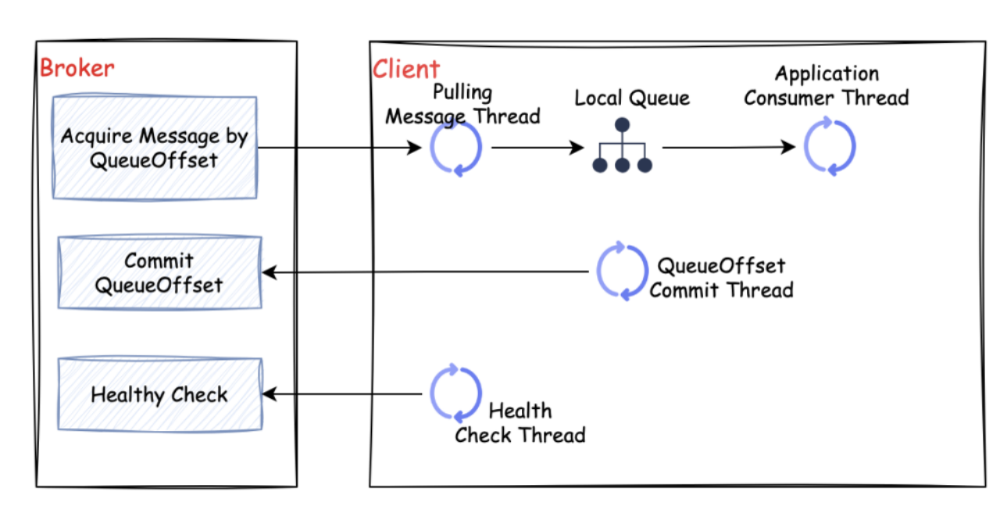
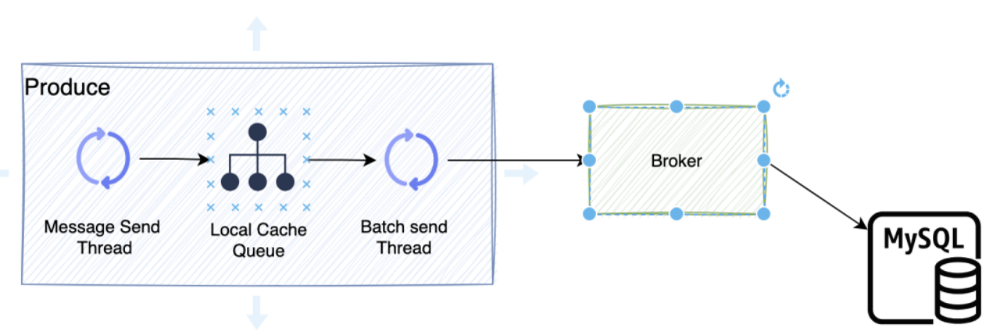

# 客户端设计

设计客户端的时候，本着简单高效的原则，我将生产者和消费者的放在同一个客户端，这样外部用户在使用的时候，只需要一个client
就可以达到和Broker交互的目的。

## 1. 消费端设计

图中的Broker 表示catMQ的服务端模块，消费者表示的是客户端的消费者模块。

我们简单介绍一下catMQ的消费端实现原理

1.  拉消费线程：根据消息偏移（QueueOffset,消费者当前消费到的位置）,从Broker拉取消息到本地的消费队列。

2.  应用消费线程：从本地消费队列中拉取消息，进行消费

3.  偏移提交线程：定时提交当前的消费信息到Broker

4.  心跳线程：定时上报心跳到Broker

5.  失败消息重试线程：对失败的消息进行重试消费

## 2. 生产者设计

生产者的消息发送分为两种模式，同步模式和异步模式

### 2.1. 同步模式

上图中的Producer表示生产者，Broker表示服务端

同步模式是一个很简单的消息存储模式，生产者将消息发送到服务端，服务端将消息持久化并且返回持久化结果

### 2.2. 异步模式

上图中的Producer表示生产者，Broker表示服务端

异步的发送模式通过减少外部通信，io交互的方式完成提高效率，通常用于一些不重要的消息传递

1.  应用发送线程：先将消息发送到本地的缓冲队列。

2.  批量发送线程：把缓冲队列的消息批量发送到broker。

3.  broker将消息批量插入到数据库中。
