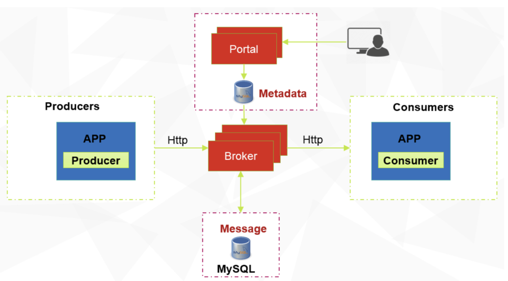

# 整体设计

小提示：如果你不是很了解分布式队列系统，了解整体设计之前，可以先阅读一下quick
start模块，动手实现一个队列 demo，会有助于你更好的了解整体的设计

## 1. 消息模型

消息的整体模型主要涉及到三个模块

1.  ConsumerGroup表示一些topic的集合，是
    CatMQ组织和协调消费者们的一种机制，会被一组消费者订阅，这组消费者会共同消费这个消费者组下面的
    topic。

2.  TopicTopic 是
    CatMQ中的消息主题，是一种逻辑概念用来组织和分类消息，没个消息都属于一个特定的主题，而消费者们也会通过订阅这些
    topic来接受对应的消息。

3.  QueueQueue 是 CatMQ 中存储消息的容器，在 CatMQ 中被设计为一张
    MySQL的数据表，每个主题可以有多个 Queue, 可以类比为 Kafka
    中的partition.

三种之间的关系如下图所示{width="6.6851859142607175in"
height="3.8367104111986in"}

## 2. 架构模块

架构模块如下图所示，图中各个模块的说明如下{width="6.8518525809273845in"
height="3.8025754593175853in"}

1.  Broker  
    CatMQ的服务端，主要负责消息的投递，拉取和查询，保证消息的高可用。核心功能如下
    a.  提供消息发送接口

    b.  提供消息拉取接口

    c.  提供队列和消费者组的动态重平衡

    d.  元数据的同步

    e.  提供消费偏移的同步

2. Portal  
   CatMQ的管理界面，主要提供一个CatMQ的可视化管理后台以及作为NameServer,做到Broker
   和路由的管理。核心功能如下：

   a.  ConsumerGroup,topic,Queue的可视化创建和修改

   b.  管理订阅关系

   c.  支持消息查询

   d.  各种审计日志和权限控制

   e.  各种监控报表

   f.  一些监控系统稳定性的定时器

3.  Producers/Consumers  
    CatMQ的生产者/消费者，同属于CatMQ客户端下面，核心功能有

    a.  消息同步和异步发送

    b.  消息拉去和消费

    c.  客户端的心跳和偏移的提交

    d.  失败消息重试和发送

4.  Metadata  
    CatMQ的元数据库，用来记录CatMQ所需要的配置信息，核心功能有：

    a.  储存consumerGroup,topic 以及订阅关系

    b.  储存数据库的节点信息

    c.  储存Queue,topic,的分配关系

    d.  储存消息偏移

5.  Message  
    CatMQ的消息数据库，用来持久化所有的消息

## 3. E-R图

1.  DbNode: 记录存储消息的数据库的节点信息，包括 jdbcurl , 用户名，密码

2.  Consumer：当前系统活跃的消费者

3.  Queue: 记录 topic 和队列表的实际分配的信息

4.  QueueOffset: 记录 consumer 和 Queue
    的实际对应关系，并且记录他们的消费偏移，（记录某个消费者消费某条
    queue的信息）

5.  Topic: 多个 Queue, 用来存储消息

6.  ConsumerGroup: topic的集合，用来记录系统中的 consumerGroup

7.  ConsumerGroupConsumer: 用来记录系统中的 Consuemr 和 ConsumerGroup
    对应的关系

8.  ConsumerGroupTopic: 用来记录 ConsumerGroup 和 Topic
    对应的关系{width="5.0in"
    height="3.7in"}

