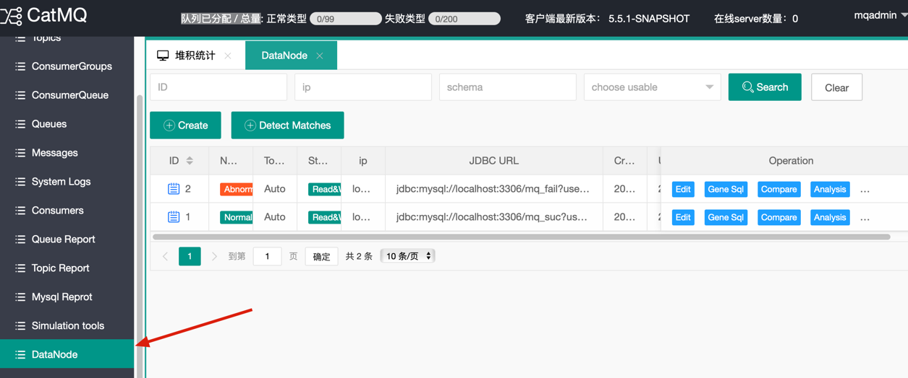
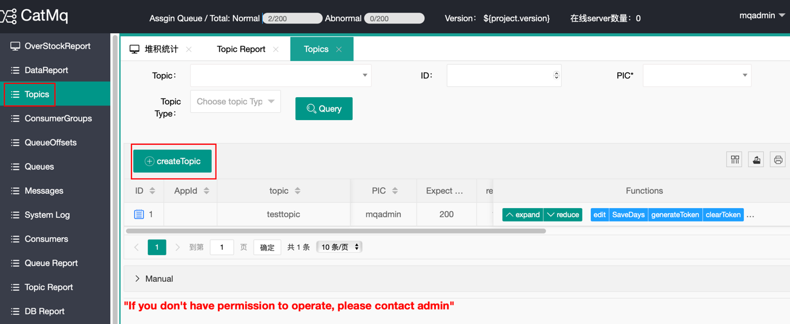
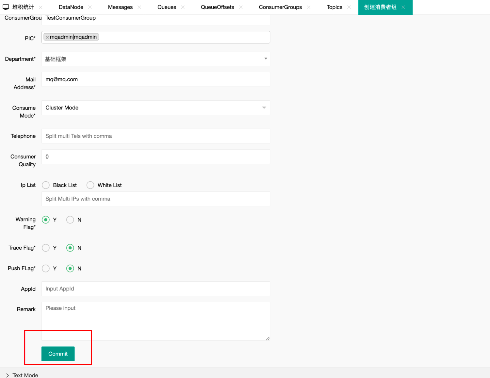
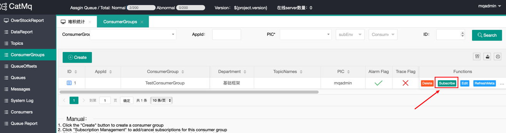
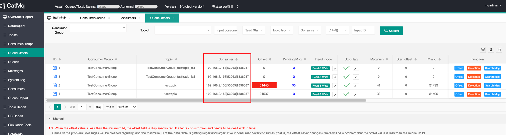
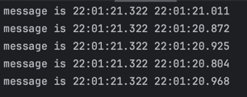

# 快速开始

本页面将简单介绍一下，如何快速的搭建一个单节点的catmq

## (一)环境准备

1. Java
   本项目基于JDK1.8+ 开发，启动项目的时候会需要JDK1.8+. 配置好Java以后，可以通过`java -version`检查java环境，样例输出如下

```shell
Java -version
Java(TM) SE Runtime Environment (build 1.8.0_74-b02)
Java HotSpot(TM) 64-Bit Server VM (build 25.74-b02, mixed mode)
```

2. Maven
   需要安装maven3.0，可以去官网下载最新版本的maven, maven 环境变量设置请参考百度谷歌。配置完成后，打开cmd命令，输入`mvn -v`,显示下图，表示配置完成。

```shell
Maven home: D:\software\apache-maven-3.6.2\bin\..
Java version: 1.8.0_262, vendor: Red Hat, Inc., runtime: D:\software\openjdk-1.8.0.262\jre
Default locale: en_US, platform encoding: GBK
OS name: "windows 10", version: "10.0", arch: "amd64", family: "windows"

```

3. MySQL
   版本要求5.7+
   连上MySQL以后，可以通过如下命令检查版本
   `SHOW VARIABLES WHERE Variable_name = 'version';`


| Variable_name | Value |
| :------------ | ----: |
| version       | 5.7.0 |

CatMQ 需要访问字典表`information_schema.tables`，来获取表的自增信息，来计算待处理消息等信息。所以需要确保此表能及时更新。 对于mysql 8以上版本推荐查看 show variables like '%information_schema_stats%'; set global information_schema_stats_expiry=10; 设置字典表的更新时间。

## （二）安装步骤

1. 在github上，下载代码到本地，以windows 系统为例，下面所有的项目默认目录为d://catmq.
2. 创建数据库
   catmq 需要三种消息库，分别为元数据库，正常消息库和失败消息库。
   根据doc/mq_basic.sql创建元数据库，元数据库只有一个（可以设置主备）。根据doc/mq_message_node_01.sql创建正常消息库，根据doc/mq_fail_message_node_01.sql文件创建失败消息库。正常消息库和失败消息库都需要多个（可以根据自己的消息量扩容）。下图是创建的数据库样例，包括：元数据库、两个正常消息库、两个失败消息库。

> mq_basic
> mq_suc
> mq_fail

3. 配置数据库信息
   catmq默认配置了三种环境的配置信息，fat,uat,pro. 当然用户可以自行通过`Spring_active`添加配置其他的环境的配置。下面的演示中，默认使用fat 环境，用文本编辑工具打开
   d:\catmq\mq-ui\src\main\resources\application-fat.properties
   d:\catmq\mq-rest\src\main\resources\application-fat.properties
   将元数据库的信息配置进去

```SHELL
spring.datasource.url = jdbc:mysql://localhost:3306/mq_basic?useUnicode=true&characterEncoding=utf8&useSSL=false
spring.datasource.username = root
spring.datasource.password = root
```

4. 编译运行
   在d://catmq 输入mvn clean install -DskipTests
   如果控制台显示success, 则证明编译成功。
   默认情况portal占用8089端口，服务端占用8080端口，测试demo占用8087端口。
   然后进入

> d:\catmq\mq-rest\target 目录下执行 java  -jar mq-rest.jar --spring.profiles.active=fat 启动服务端。

> d:\mq-cat\mq-ui\target 目录下执行 java  -jar mq-ui.jar --spring.profiles.active=fat 启动管理端portal。

注意：测试demo暂时还不能启动（需要等到消息库初始化完成，并且在portal上手动创建测试程序所需的topic、consumerGroup、订阅关系以后可以启动）
5. 启动验证系统。
在chrome浏览器访问 http://localhost:8080/ 如果出现下图表示CatMQ服务端启动正常。
访问 http://localhost:8090/ 如果出现登录页面，并且可以登录成功，则证明可以正常访问，用户名和密码都是：`mqadmin`


## (三)元数据的初始化

为了能够启动测试，我们需要初始化一些数据

1. 初始化消息的存储位置

   1. 启动CatMQ的管理页面(CatMQ-ui模块)，通过账号和密码`mqadmin`登录系统。然后点击左侧的“DataNode”
     
   2. 点击 "Create"
     
   3. 跳出的数据库详细信息中，分为主库(master)和从库(slave)，如果没有从库可以不填，数据库是我们上文中提到的mq_suc 的连接信息。

   > 注意：如果“”Database”填写的是正常消息库的名字，则“Store Type”需选择normal（如上图标红所示）。如果“”Database”填写的是失败消息库的名字，则“Store Type”需选择Abnormal。
   >

   4. 点击“提交”，如果看到如下记录，则说明message_node_01这一个节点初始化成功。

## (四)客户端的demo显示

完成上述步骤以后，我们就可以去CatMQ的mq-client-demo模块中启动该模块
messageQueue.xml文件中定义了ConsumerGroup、Topic、以及它们之间的订阅关系（含义：test1sub订阅了topic：test1和test4）。receiverType指定的是每一个topic的消息处理类。

demo就是在项目中的模式是CatMQ 的最小可执行的Example,这里我们已经做好了messageQueue.xml的配置，此次您无需做任何修改

1. 新建topic  
   登录系统管理页面Portal,默认为localhost:8090, 初始化的用户名和密码都为：mqadmin。登录进入以后，点击页面左侧的消息主题管理进入如下画面  
     
   点击“创建”按钮，进入topic 创建界面，然后再“topic名称处”输入testtopic  
     
   点击“提交”完成topic的创建。
2. 新建ConsumerGroup  
   在管理界面，点击左侧的消费者组管理，然后点击“创建”按钮，进入consumeGroup创建界面：  
   
   我们创建一个名为testConsumerGroup的consumerGroup  
   
   创建成功之后，可以看到页面以及创建成功
   
3. 创建订阅关系
   建立consumerGroup和topic的关联,点击上一个画面中的subscribe开始订阅  
     
   点击添加订阅，创建订阅关系  
     
   点击确认，订阅成功
   
   
4. 启动客户端的demo,运行程序 
   1. 进入 'cat-mq-client-test\target' 下面执行 ‘java  -jar mq-client-test-001-1.0.0.jar --spring.profiles.active=fat’ 启动客户端demo
   2. 进入‘ConsumerGroupConsumer’, 出现下面的数据表示客户端启动成功,已经成功注册到系统中
   
5. 测试消息的发送和消息的消费
   1. 在浏览器中的网址栏，或者postman中输入下面的URL地址： `http://localhost:8087/test1?topicName=testtopic&count=2`  这里表示给Topic: `testtopic` 发送5条消息
   2. 在 `catmq-client-test`的 log 中会看到 下面的信息表示消息的发送和消费都正常。
   
6. 常见问题
   如果应用无法启用，请检查8080，8087，8087 端口是否被占用。
